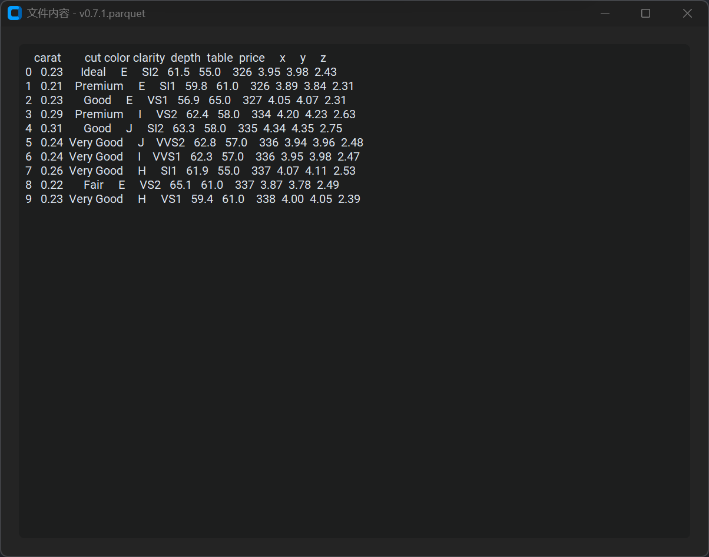

# ORC-Parquet-Viewer

> *1. No English support*
> *2. Only work on windows*
> *3. Only work for me maybe*

## 选择一个文件，打开，就这么简单




## 安装环境

```bash
conda create -n viewer python=3.12
conda activate viewer

pip install pyinstaller
pip install customtkinter
pip install CTkMessagebox
pip install pyarrow
pip install pandas
```

## 打包脚本

```bash
pyinstaller --onefile --windowed --name orc-parquet-viewer main.py 
```

## log:

### v0.01

 cost: 1h
 感谢ai, 不知道有没有下个版本
 TODO: 
    1. orc文件读取
    2. 元数据打印
